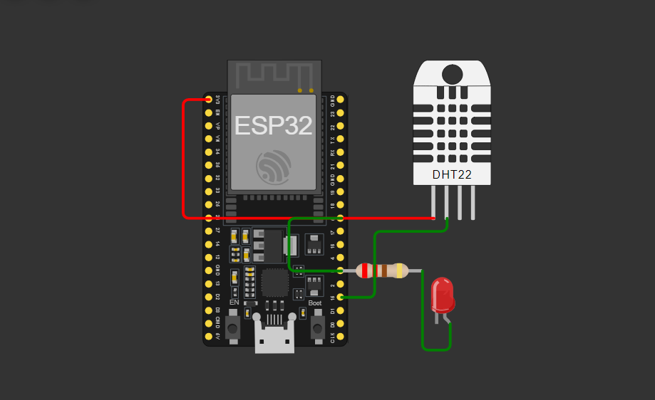
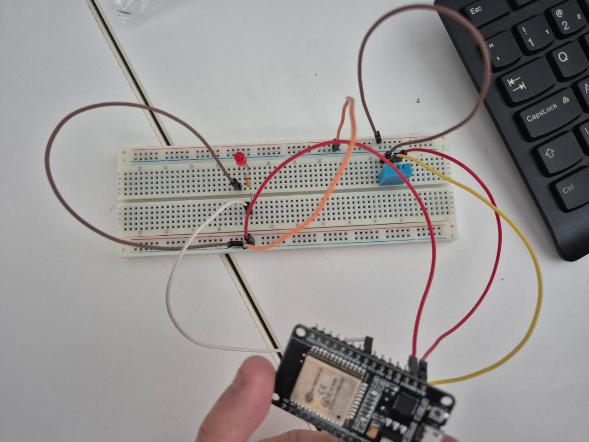
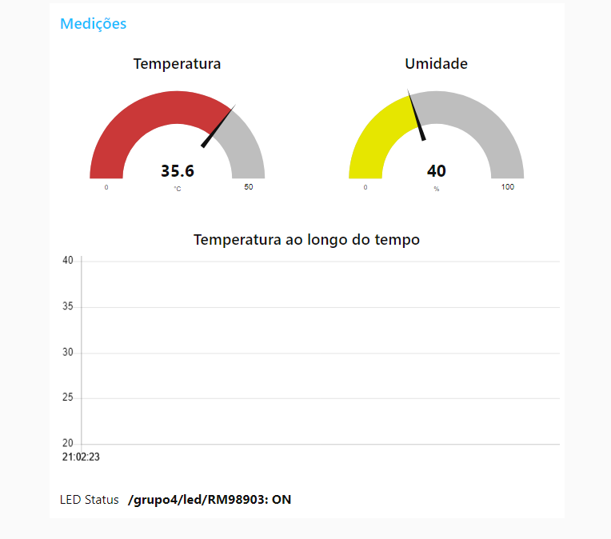

# Projeto de Controle de Temperatura IoT

## Visão Geral

Este projeto implementa um sistema de controle de temperatura baseado em IoT usando um microcontrolador ESP32, sensor de temperatura e umidade DHT22 e um indicador LED. O sistema monitora temperatura e umidade, publica os dados em um broker MQTT e controla um LED com base em limiares de temperatura predefinidos para diferentes membros da equipe.

Nesse GIF podemos observar o funcionamento do projeto na prática. Ao encostar no sensor ele aumenta a sua temperatura e assim liga o LED.

Usamos os seguintes hardwares:

-   Placa de Desenvolvimento ESP32
-   Sensor de Temperatura e Umidade DHT11 (No simulador utilizamos o DHT22)
-   LED (para indicação visual)
-   Resistor de 220Ω (para o LED)
-   Protoboard e jumpers

## Índice

-   [Características](#características)
-   [Requisitos de Software](#requisitos-de-software)
-   [Configuração e Instalação](#configuração-e-instalação)
-   [Tópicos MQTT](#tópicos-mqtt)
-   [Dashboard Node-RED](#dashboard-node-red)
-   [Membros da Equipe](#membros-da-equipe)

## Características

-   Monitoramento em tempo real de temperatura e umidade usando o sensor DHT22
-   Comunicação MQTT para publicação de dados e controle de LED
-   Limiares de temperatura personalizáveis para ativação do LED
-   Dashboard Node-RED para visualização de dados
-   Ambiente simulado usando Wokwi e implementação física

## Requisitos de Software

-   Arduino IDE (com suporte à placa ESP32)
-   Bibliotecas:
    -   WiFi.h
    -   PubSubClient.h
    -   DHTesp.h
-   Node-RED (para criação do dashboard)
-   Broker MQTT (ex: test.mosquitto.org)

## Configuração e Instalação

1. **Como configuramos o Hardware**:

    - Conectamos o sensor DHT22 ao pino GPIO 15 do ESP32.
    - Conectamos o LED ao pino GPIO 5 do ESP32 através de um resistor de 220Ω.

2. **Como configuramos na IDE**:

    - Instalamos as bibliotecas necessárias no Arduino IDE.
    - Adaptamos o código do silumador.
    - Atualizamos as credenciais de WiFi e os detalhes do broker MQTT no código.
    - Fizemos o upload do código para o ESP32 e funcionou!!.

3. **Configuração do Node-RED**:
    - Importe o fluxo Node-RED fornecido.
    - Configure os nós MQTT para conectar ao seu broker.
    - Implemente o fluxo e acesse o dashboard.

## Tópicos MQTT

-   `/grupo4/temperatura`: Leituras de temperatura
-   `/grupo4/umidade`: Leituras de umidade
-   `/grupo4/led/{RM}`: Status do LED para cada membro da equipe (ON/OFF)
-   `/grupo4/status`: Mensagens de status do sistema
-   `/grupo4/comandos`: Canal de comando (para uso futuro)

## Dashboard Node-RED

O dashboard Node-RED fornece uma interface visual para monitoramento do sistema.

-   Gráficos em tempo real de temperatura e umidade
-   Indicadores de status do LED para cada membro da equipe
-   Mensagens de status do sistema

Ele está presente dentro da pasta src juntamente com todo o codigo fonte do projeto!

## Membros da Equipe

<table>
  <tr>
    <td align="center">
      <a href="https://github.com/nichol6s">
         
        
          <strong>Nicholas Santos</strong>
        
      </a>
    </td>
    <td align="center">
      <a href="https://github.com/VitorKubica">
         
        
          <strong>Vitor Kubica</strong>
        
      </a>
    </td>
    <td align="center">
      <a href="https://github.com/DuduViolante">
         
        
          <strong>Eduardo Violante</strong>
        
      </a>
    </td>
    <td align="center">
        <a href="https://github.com/biasvestka">
         
        
            <strong>Beatriz Svestka</strong>
        
      </a>
    </td>
  </tr>
</table>
